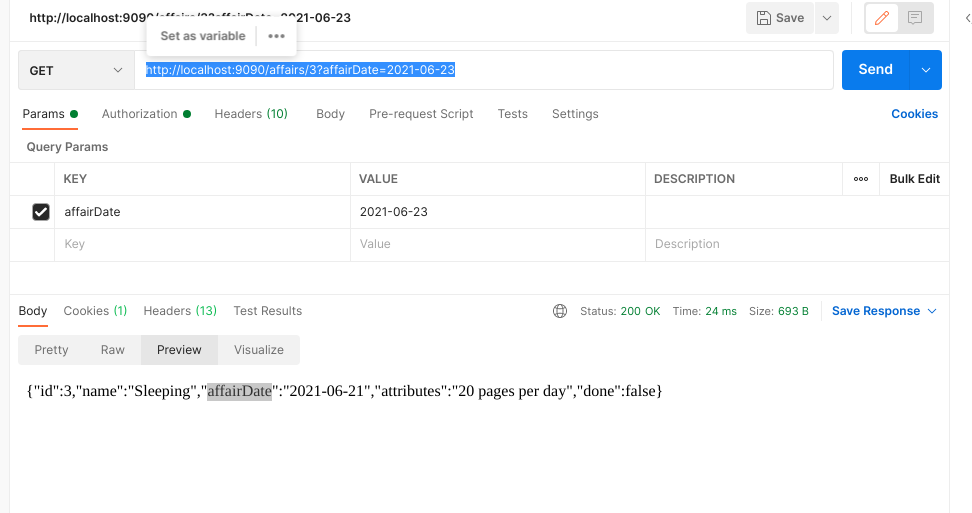

# kcell_gradle
!!!!!!!!!!!!!!!!!!!!!!!!!!!!!!!!!!!!!!!!!!!!!!!!!!!!

Hello dear friend, this is a test task for Kcell Company.

First of all, you need to copy this project using url and run in your IDE.
Then u can get access from http://localhost:9090.

Then, you need to go with using POST method http://localhost:9090/auth/login and authorize with one of this users (log:"a", pass:"1") or (log:"b", pass:"2").

In result, in header with name 'x-csrf-token' u get token, u will use it for next authorization.

Then copy it.

To access server we need to use this token, add to header of request key="x-csrf-token" and like value token, which u copied earlier.
Like in screenshot

We finished with authorization.

!!!!!!!!!!!!!!!!!!!!!!!!!!!!!!!!!!!!!!!!!!!!!!!!!!!!!!!!!!!

Next I added some screens of the results to request.

1. Just listing all available affairs  with get. http://localhost:9090/affairs

   
2. Searching by id with get.
   http://localhost:9090/affairs/5
   

3. Searching by date with get. http://localhost:9090/affairs/3?affairDate=2021-06-23
   
   
4. Adding new affair using post with body json. http://localhost:9090/affairs 
   Example:"{       "name": "Sleeping",
   "affairDate": "2021-07-20",
   "attributes": "Please do it"}"
   
   

4. Next one, is using put and making some changes. http://localhost:9090/affairs/someId
   Also in body we need to change some fields.
   
   
5. Finally, it is deleting, use delete operation and http://localhost:9090/affairs/someid
   
   And as u can see affair with id 8 deleted.
   
6. Also, I forgot about status of affair, for changing it to true u need to use POST and link http://localhost:9090/affairs/done/someid

   